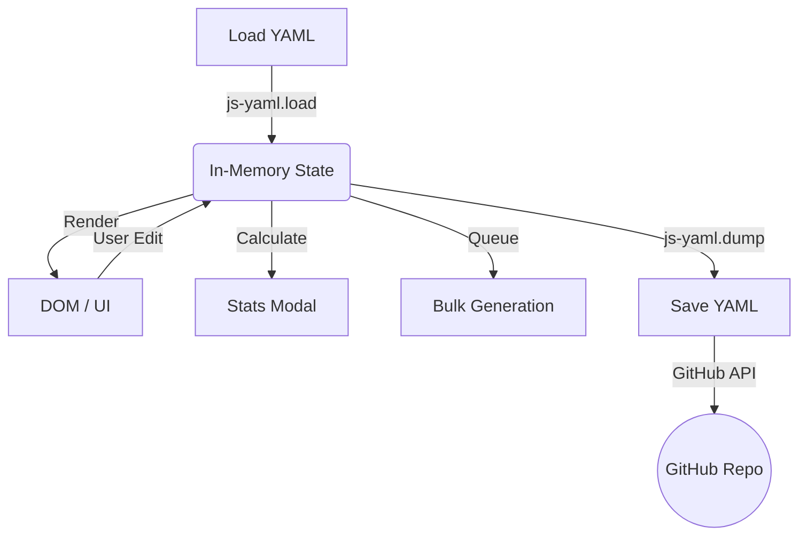

# YAML <-> HTML Logic Formula

This document explains the bi-directional relationship between the data source (`scenes.yaml`) and the frontend application (`post_prod_artifact_plan.html`).

## 1. Data Schema (`scenes.yaml`)

The `scenes.yaml` file acts as the Single Source of Truth for the project.

### Root Object
| Field | Type | Description |
| :--- | :--- | :--- |
| `main_context` | String | Global context applied to all generations. |
| `verified_main_context` | Boolean | **[New]** Toggle to indicate if the main context is finalized/verified. |
| `scenes` | Array | List of Scene objects. |

### Scene Object
Each item in the `scenes` array represents a distinct segment of the video.

| Field | Type | Description |
| :--- | :--- | :--- |
| `id` | String | Unique identifier (e.g., "SCENE 01"). |
| `title` | String | Human-readable title. |
| `color` | String | CSS class for border color (e.g., `border-l-4 border-blue-500`). Used for UI visualization. |
| `context` | String | Scene-specific context (mood, setting). |
| `verified_context` | Boolean | **[New]** Toggle to indicate if the scene context is verified. |
| `transition` | String | Description of transition to the next scene. |
| `verified_transition` | Boolean | **[New]** Toggle to indicate if transition is verified. |
| `lines` | Array | List of Line/Shot objects containing scripts and prompts. |

### Line Object (Prompts)
Within `lines`, the `verified_prompts` object mirrors the `prompts` object keys (image, graphic, music, etc.), storing a Boolean `true/false` for each prompt type.

---

## 2. Application Flow (`post_prod_artifact_plan.html`)

The HTML file is a single-page application that loads, renders, modifies, and saves this data.

### Initialization & Loading
1.  **`downloadYAML()` / File Upload**: The user provides the YAML content.
2.  **`parseAndLoadData(yamlText)`**:
    - Uses `jsyaml.load()` to parse the string.
    - **State Hydration**:
        - `window.mainContext` is set from `data.main_context`.
        - Global `scenes` variable is populated with `data.scenes`.

### Rendering
-   **`renderScenes()`**: Clears the DOM and rebuilds the UI based on the `scenes` array.
-   **Bindings**: Use `oninput` and `onchange` handlers to bind UI elements directly to the `scenes` array objects.

### Features & Logic

#### Stats Calculation (`openStatsModal`)
The app calculates real-time statistics from the open project:
- **Scene & Line Counts**: Aggregates total length of arrays.
- **Word Count**: Splits script text by whitespace `/\s+/`.
- **Duration Estimation**: Assumes 2 words = 1 second (`wordCount / 2`).

#### GitHub Integration (`saveGithubConfig`)
- Stores configuration (`owner`, `repo`, `path`, `token`) in `localStorage` as `github_config`.
- **`saveChanges()`**:
    1. Dumps current state to YAML.
    2. Encodes content to Base64.
    3. Sends a `PUT` request to `https://api.github.com/repos/{owner}/{repo}/contents/{path}`.
    4. Requires a Personal Access Token (PAT) with `repo` scope.

#### Bulk Generation (`startBulkGeneration`)
- Iterates through all scenes and lines.
- Adds tasks to a queue **ONLY IF** they are marked as `Verified for Bulk` (`verified_prompts[type] === true`).
- Processes the queue sequentially to respect API rate limits.

### Reactivity (User Actions)
When a user interacts with the UI, specific handler functions update the in-memory data model immediately. Changes are persisted only when "Save YAML" is clicked (which commits to GitHub).

---

## 3. Workflow Goals

### Workflow Goals
The goal of this system is to streamline the post-production process for high-value documentary videos.
- **Multimodal Planning**: Defining Image, Graphic, Music, Animation, and Sound Effects for every single line of script *before* generation.
- **Verification First**: Contexts and prompts must be "Verified" before bulk generation.
- **Bulk Automation**: The valid YAML acts as an instruction set for the bulk generator, ensuring only approved assets are created.
